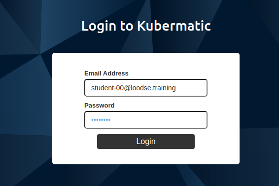
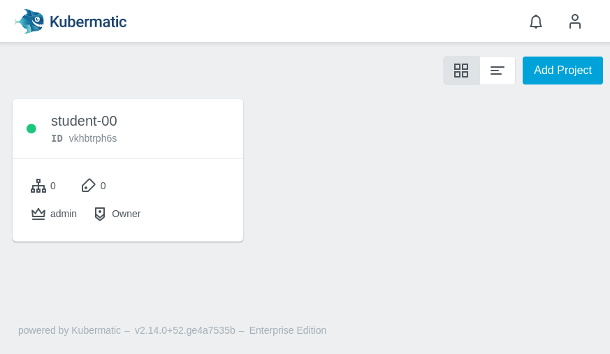

# Install Kubermatic Operator

The next step is installing the Kubermatic Operator. The operator will listen to the CRD `KubermaticConfiguration` and install all needed Kubermatic components into your cluster.

## Install the Kubermatic Operator chart

Before installing the Kubermatic Operator, the Kubermatic CRDs need to be installed. You can install them like this:

```bash
kubectl apply -f kubermatic-repo/charts/kubermatic/crd 
```

After this, the operator chart can be installed like the previous Helm charts:

```bash
helm upgrade --install --create-namespace --wait --values ./kubermatic-setup-files/values.yaml --namespace kubermatic kubermatic-operator kubermatic-repo/charts/kubermatic-operator/
```
### Validation

Once again, let's check that the operator is working properly:

```bash
kubectl -n kubermatic get pods
#NAME                                   READY   STATUS    RESTARTS   AGE
#kubermatic-operator-769986fc8b-7gpsc   1/1     Running   0          28m
```

## Create KubermaticConfiguration

It's now time to configure Kubermatic itself. This will be done in a `KubermaticConfiguration` CRD, for which a [full example](https://docs.kubermatic.com/kubermatic/master/concepts/kubermaticconfiguration/) with all options is available. A minimal configuration has been placed at [kubermatic-setup-files.template/kubermatic.yaml](kubermatic-setup-files.template/kubermatic.yaml). To configure your own version, first create a copy to your `kubermatic-setup-files` folder:
 ```bash
 cd YOUR_TRAINING_FOLDER/kubermatic                                                       
 cp kubermatic-setup-files.template/kubermatic.yaml ./kubermatic-setup-files/
 ```

For the purpose of this document we will only need to configure the `TODO-STUDENT-DNS` entries:

[`./kubermatic-setup-files/kubermatic.yaml`](./kubermatic-setup-files/kubermatic.yaml)
```yaml
apiVersion: operator.kubermatic.io/v1alpha1
kind: KubermaticConfiguration
metadata:
  name: kubermatic
  namespace: kubermatic
spec:
  # These secret keys configure the way components commmunicate with Dex.
  auth:
    # this must match the secret configured for the kubermatic client from
    # the values.yaml.
    issuerClientSecret: nzzP4Olor2vzAJwZSBDL5QcVtNMYE1xM

    # these need to be randomly generated
    #
    #issuerCookieKey: <a-random-key>
    issuerCookieKey: 635kRsBMY0t9sGgRQlOnfvyHF9Knq63O
    #serviceAccountKey: <another-random-key>
    serviceAccountKey: 0At9dr0P6HPLmXsxlGgJ7zCXQbMamf0T
  imagePullSecret: |
    {
      "auths": {
        "quay.io": {
#          "auth": "TODO ADD PULL SECRET",
          "email": ""
        }
      }
    }
  ingress:
    # this domain must match what you configured as dex.ingress.host
    # in the values.yaml
    domain: kubermatic.TODO-STUDENT-DNS.loodse.training
    certificateIssuer:
      name: letsencrypt-prod
```
Use your editor or `sed` to replace DNS names:

### Replace TODO-STUDENT-DNS
Next we want to configure the DNS names in the `kubermatic.yaml`. Before we create the DNS entries with the according LoadBalancer IP we need to set the necessary domain names in the values.yaml. Cert manager will use these domains to request the necessary certificates from Let's encrypt later on:

```bash
## replace every entry of: TODO-STUDENT-DNS
grep TODO-STUDENT-DNS kubermatic-setup-files/kubermatic.yaml

# get gcloud DNS_ZONE
gcloud dns managed-zones list
NAME                DNS_NAME                             DESCRIPTION  VISIBILITY
student-XX-training student-XX-training.loodse.training. k8c          public

## adjust to your zone name
export DNS_ZONE=student-XX-training
# sed -i 's/original/new/g' file
sed -i 's/TODO-STUDENT-DNS/'"$DNS_ZONE"'/g' kubermatic-setup-files/kubermatic.yaml

## check results
cat kubermatic-setup-files/kubermatic.yaml
```

### Configure Pull Secret for Kubermatic images

To enable the Kubermatic master cluster to download the protected Kubermatic images, we need to configure the image pull secret for the operator in the `kubermatic.yaml` as well. This will later be used for the deployment of the Kubermatic seed components
.
```bash
cat secrets/kubermatic-*.json
```
```
{
  "auths": {
    "quay.io": {
      "auth": "xxx-YOUR-SECRET-KEY-xxx",
      "email": ""
    }
  }
}
```
Now replace the phrase `TODO ADD PULL SECRET` in the `kubermatic.yaml`:
```bash
vim kubermatic-setup-files/kubermatic.yaml
```
now replace
```
  # insert the Docker authentication JSON provided by Kubermatic here
  imagePullSecret: |
    {
      "auths": {
        "quay.io": {
          "auth": "xxx-YOUR-SECRET-KEY-xxx",
          "email": ""
        }
      }
    }
```

## Apply the config
Now trigger the deployment of the Kubermatic components by:

```bash
kubectl apply -f kubermatic-setup-files/kubermatic.yaml
```

This will cause the operator to provision a Kubermatic master cluster. You can observe the progress:

```bash
watch kubectl -n kubermatic get deployments,pods
```
```
kubectl -n kubermatic get deployments,pods
NAME                                                   READY   UP-TO-DATE   AVAILABLE   AGE
deployment.apps/kubermatic-api                         2/2     2            2           13m
deployment.apps/kubermatic-dashboard                   1/2     2            1           13m
deployment.apps/kubermatic-master-controller-manager   2/2     2            2           13m
deployment.apps/kubermatic-operator                    1/1     1            1           12h

NAME                                                       READY   STATUS             RESTARTS   AGE
pod/kubermatic-api-59bfd56f46-dzshv                        1/1     Running            0          13m
pod/kubermatic-api-59bfd56f46-fgjjm                        1/1     Running            0          13m
pod/kubermatic-dashboard-68cc67c75b-85l99                  1/1     Running            0          13m
pod/kubermatic-dashboard-68cc67c75b-8cwgw                  1/1     Running            0          13m
pod/kubermatic-master-controller-manager-f947d46f4-8bfj8   1/1     Running            0          13m
pod/kubermatic-master-controller-manager-f947d46f4-qdjhv   1/1     Running            0          13m
pod/kubermatic-operator-544575bd5d-z7md8                   1/1     Running            0          10h
```

If nothing happens take a look at the `kubermatic-operator` pod logs, maybe you have some format error:
```bash
kubectl -n kubermatic logs kubermatic-operator-xxxx-xxxx
```
**NOTE:** Every change in configuration can be executed by `kubectl apply -f kubermatic-setup-files/kubermatic.yaml`. The Operator will update the Kubermatic installation accordingly.

**NOTE:** If you delete the `KubermaticConfiguration`, e.g. with `kubectl delete -f kubermatic-setup-files/kubermatic.yaml`, the operator will also **DELETE** all Kubermatic components!

### Verify

Now also verify if an `Ingress` and a valid `Certificate` were created:
```bash
kubectl -n kubermatic get ingress,certificate
```
```
NAME                            HOSTS                                      ADDRESS        PORTS     AGE
ingress.extensions/kubermatic   kubermatic.student-00.loodse.training   34.91.40.238   80, 443   15m

NAME                                     READY   SECRET           AGE
certificate.cert-manager.io/kubermatic   True    kubermatic-tls   15m
```

Youd should now be able to see the Dashboard and login with your configured e-mail ID of [20_install_dependencies.md)](20_install_dependencies.md), for example: `student-XX-xxx@loodse.training` and password `password`:



Now try to create a project `student-XX`. Before we can create cluster, we need to setup a `Seed` object for the Kubermatic seed cluster.



This should also be visible in your master cluster:
```bash
kubectl get project
```
```
NAME         AGE    HUMANREADABLENAME   STATUS
vkhbtrph6s   2m1s   student-00          Active
```
