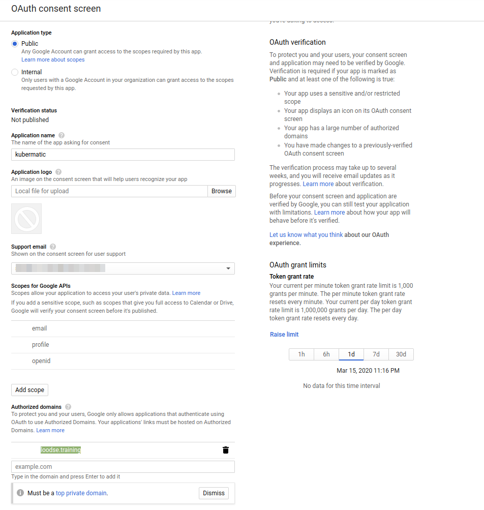

TODO
----


* Configure OAuth client for Dex
  
  To use an OAuth client authentication, in this case our Google account, we change the OpenIDConnect settings in the `oauth` section:
  
  1. Create an `OAuth Client`, **User Type `External`**, **Type `Web application`**, **Application type `Public`**, **Authorized domains:`loodse.training`**, **Redirect URI** `https://kubermatic.YOUR_DNS_ZONE.loodse.training/dex/callback` at https://console.cloud.google.com/apis/credentials/oauthclient. 
  ```bash
  grep 'dex/callback' kubermatic-setup-files/values.yaml
  redirectURI: https://kubermatic.student-XX.loodse.training/dex/callback
  ```
  **IMPORTANT NOTE:** First create the `OAuth 2.0 Client IDs`, afterwards edit it and add the `Authorized redirect URIs` (otherwise an error won't let you pass).
  You should get an account similar to this one:
  
  
  
  2. Now copy `Client ID` and `Client secret` to the `oauth` section in the `values.yaml`
  ```bash
    vim kubermatic-setup-files/values.yaml
  ```
  ```yaml
    - type: oidc
      id: google
      name: Google
      config:
        # oauth client creation: https://console.cloud.google.com/apis/credentials
        issuer: https://accounts.google.com
        clientID: TODO-GOOGLE-CLIENT-ID
        clientSecret: TODO-GOOGLE-CLIENT-SECRET
        redirectURI: https://kubermatic.student-00.loodse.training/dex/callback
  ```
  ```
  helm upgrade --tiller-namespace kubermatic --install --wait --timeout 300 --values kubermatic-setup-files/values.yaml --namespace oauth oauth kubermatic-installer/charts/oauth/      
  
  ### check created resources
  kubectl get pod -n oauth 
  NAME                 READY   STATUS    RESTARTS   AGE
  dex-656f56bf-9r7x7   1/1     Running   1          20s
  dex-656f56bf-zfghr   1/1     Running   0          20s

  kubectl get ingress -n oauth 
  NAME   HOSTS                                        ADDRESS   PORTS     AGE
  dex    kubermatic.student-00.loodse.training             80, 443   30s
  ``` 

* Proceed with the installation of the remaining charts:

  ```bash 
  # indenty aware proxies for monitoring, logging, ...
  helm upgrade --tiller-namespace kubermatic --install --wait --timeout 300 --values kubermatic-setup-files/values.yaml --namespace iap iap kubermatic-installer/charts/iap/
  ```
  Let's check if all components are running
  ```
  kubectl get pod,svc -n kubermatic 
  NAME                                        READY   STATUS    RESTARTS   AGE
  pod/controller-manager-v1-bdc574bdd-2g5dc   1/1     Running   0          14m
  pod/controller-manager-v1-bdc574bdd-5ksk6   1/1     Running   0          14m
  pod/kubermatic-api-v1-bb45bc877-bj45h       1/1     Running   0          14m
  pod/kubermatic-api-v1-bb45bc877-jwqd7       1/1     Running   0          14m
  pod/kubermatic-ui-v2-84695d484d-7zxx2       1/1     Running   0          14m
  pod/kubermatic-ui-v2-84695d484d-c8q8r       1/1     Running   0          14m
  pod/master-controller-v1-d46b8986c-5x796    1/1     Running   0          14m
  
  NAME                         TYPE        CLUSTER-IP       EXTERNAL-IP   PORT(S)                       AGE
  service/controller-manager   ClusterIP   10.104.42.163    <none>        8085/TCP                      14m
  service/kubermatic-api       NodePort    10.101.124.171   <none>        80:31369/TCP,8085:32108/TCP   14m
  service/kubermatic-ui        NodePort    10.105.8.224     <none>        80:32186/TCP                  14m
  service/seed-webhook         ClusterIP   10.110.133.136   <none>        443/TCP                       14m
  
  ### ingress rules
  kubectl get ingresses -A
  NAMESPACE    NAME                                         HOSTS                                                     ADDRESS   PORTS     AGE
  default      cert-manager-acme-challenge-kubermatic-all   *                                                                   80        127m
  iap          alertmanager-iap                             alertmanager.kubermatic.student-00.loodse.training             80, 443   15m
  iap          grafana-iap                                  grafana.kubermatic.student-00.loodse.training                  80, 443   15m
  iap          kibana-iap                                   kibana.kubermatic.student-00.loodse.training                   80, 443   15m
  iap          prometheus-iap                               prometheus.kubermatic.student-00.loodse.training               80, 443   15m
  kubermatic   api                                          kubermatic.student-00.loodse.training                          80, 443   16m
  oauth        dex                                          kubermatic.student-00.loodse.training                          80, 443   99m
  ```
  If everything is up and running, we should be able to login to the UI: https://kubermatic.student-00.loodse.training
  
* Next we will install the Kubermatic EFK logging stack:
  ```
  # For logging stack, ensure that all charts are deployed within the logging namespace
  helm upgrade --tiller-namespace kubermatic --install --wait --timeout 300 --values kubermatic-setup-files/values.yaml --namespace logging elasticsearch kubermatic-installer/charts/logging/elasticsearch/
  helm upgrade --tiller-namespace kubermatic --install --wait --timeout 300 --values kubermatic-setup-files/values.yaml --namespace logging fluentbit kubermatic-installer/charts/logging/fluentbit/
  helm upgrade --tiller-namespace kubermatic --install --wait --timeout 300 --values kubermatic-setup-files/values.yaml --namespace logging kibana kubermatic-installer/charts/logging/kibana/
  ```
  
* Finally you can proceed with the installation of the [Kubermatic monitoring stack (Prometheus, Grafana, Alertmanager)](https://docs.loodse.com/kubermatic/master/monitoring/architecture/):

  ```  
  helm upgrade --tiller-namespace kubermatic --install --wait --timeout 300 --values kubermatic-setup-files/values.yaml --namespace monitoring prometheus kubermatic-installer/charts/monitoring/prometheus/
  helm upgrade --tiller-namespace kubermatic --install --wait --timeout 300 --values kubermatic-setup-files/values.yaml --namespace monitoring node-exporter kubermatic-installer/charts/monitoring/node-exporter/
  helm upgrade --tiller-namespace kubermatic --install --wait --timeout 300 --values kubermatic-setup-files/values.yaml --namespace monitoring kube-state-metrics kubermatic-installer/charts/monitoring/kube-state-metrics/
  helm upgrade --tiller-namespace kubermatic --install --wait --timeout 300 --values kubermatic-setup-files/values.yaml --namespace monitoring blackbox-exporter kubermatic-installer/charts/monitoring/blackbox-exporter/
  helm upgrade --tiller-namespace kubermatic --install --wait --timeout 300 --values kubermatic-setup-files/values.yaml --namespace monitoring grafana kubermatic-installer/charts/monitoring/grafana/
  
  # For the alert manager
  
  helm upgrade --tiller-namespace kubermatic --install --wait --timeout 300 --values kubermatic-setup-files/values.yaml --namespace monitoring alertmanager kubermatic-installer/charts/monitoring/alertmanager/
  
  # N.B - Currently the alert-manager will not send any alerts. The target for alerts 
  # can configured there at the values.yaml
  
* cluster backups (etcd and volumes) (requires proper configuration in the chart's values.yaml)
  ```  
  helm upgrade --tiller-namespace kubermatic --install --wait --timeout 300 --values kubermatic-setup-files/values.yaml --namespace velero velero kubermatic-installer/charts/backup/velero/
  ```

### Explore Monitoring / Logging Stack

- Kibana: https://kibana.kubermatic.student-00.loodse.training
- Grafana: https://grafana.kubermatic.student-00.loodse.training
- Prometheus: https://prometheus.student-00.loodse.training
- Alertmanager: https://alertmanager.kubermatic.student-00.loodse.training

